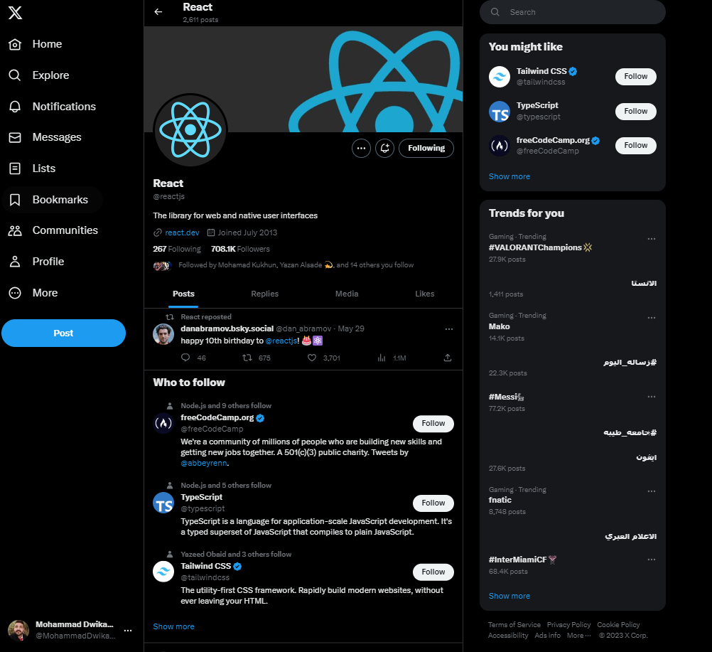
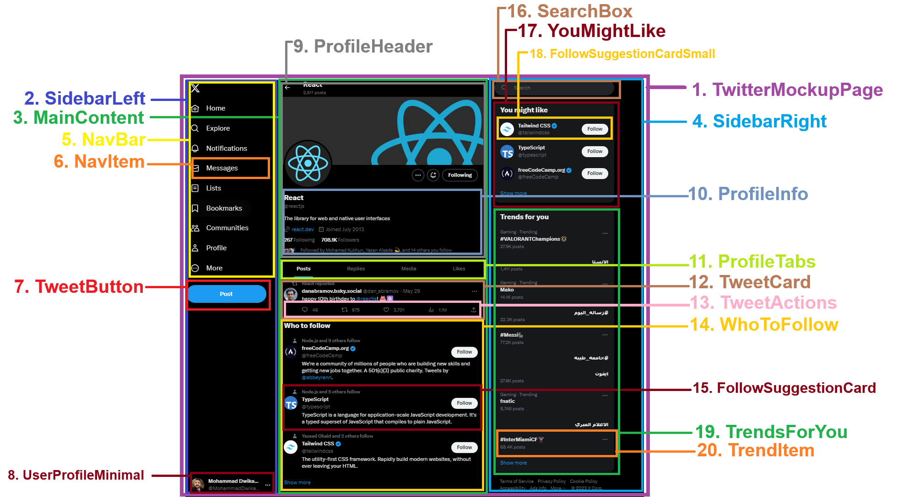

# React Profile on X

A pixel-perfect Twitter/X profile page mockup built with React and Vite. This project demonstrates a modular, scalable approach to building a modern social media UI, including left and right sidebars, profile/timeline, and interactive suggestions/trends.

## UI Reference
- The main UI is based on a provided image of a Twitter/X profile page.


- The image was divided into logical UI components, each implemented as a React component.



## Features
- **SidebarLeft**: Navigation, tweet button, and minimal user profile.
- **MainContent**: Profile header, tabs, posts timeline, and who-to-follow suggestions.
- **SidebarRight**: Search box, "You might like" suggestions, trending topics, and footer links.
- **Reusable Components**: All UI elements are split into logical folders for maintainability.
- **Static Data**: All profile, post, suggestion, and trend data is provided via `src/data/twitterData.jsx`.
- **Modern Styling**: Custom CSS modules for each major section, matching Twitter/X's dark theme.
- **Note:** The layout is not fully responsive; it is optimized for desktop view only.

## Project Structure
```
my-app/
├── .github/
├── public/
│   └── vite.svg
├── src/
│   ├── App.jsx
│   ├── main.jsx
│   ├── assets/
│   │   ├── avatar.jpg
│   │   ├── freeCodeCamp.jpg
│   │   ├── IconsStyles.css
│   │   ├── logo-white.png
│   │   ├── react-cover.jpg
│   │   ├── react-logo.png
│   │   ├── react.svg
│   │   ├── Tailwind CSS.png
│   │   └── TypeScript.png
│   ├── components/
│   │   ├── MainContent.jsx
│   │   ├── SidebarLeft.jsx
│   │   ├── SidebarRight.jsx
│   │   ├── TwitterMockupPage.jsx
│   │   ├── Common/
│   │   │   ├── BellWithPlus.jsx
│   │   │   ├── Button.jsx
│   │   │   ├── FollowButton.jsx
│   │   │   ├── SearchBox.jsx
│   │   │   └── TweetButton.jsx
│   │   ├── layout/
│   │   │   ├── FooterRight.jsx
│   │   │   ├── NavBar.jsx
│   │   │   ├── NavItem.jsx
│   │   │   └── UserProfileMinimal.jsx
│   │   ├── profile/
│   │   │   ├── ProfileHeader.jsx
│   │   │   ├── ProfileInfo.jsx
│   │   │   └── ProfileTabs.jsx
│   │   ├── suggestions/
│   │   │   ├── FollowSuggestionCard.jsx
│   │   │   ├── FollowSuggestionCardSmall.jsx
│   │   │   ├── TrendItem.jsx
│   │   │   ├── TrendsForYou.jsx
│   │   │   ├── WhoToFollow.jsx
│   │   │   └── YouMightLike.jsx
│   │   ├── tweet/
│   │   │   ├── Posts.jsx
│   │   │   ├── TweetAction.jsx
│   │   │   └── TweetCard.jsx
│   ├── data/
│   │   └── twitterData.jsx
│   └── styles/
│       ├── App.css
│       ├── index.css
│       ├── MainContent.css
│       └── SidebarRight.css
├── package.json
├── vite.config.js
├── README.md
```

## Key Components
- **SidebarLeft**: Navigation and user info
- **MainContent**: Profile, tabs, posts, suggestions
- **SidebarRight**: Search, suggestions, trends, footer
- **YouMightLike**: Renders multiple `FollowSuggestionCardSmall` components
- **TrendsForYou**: Renders multiple `TrendItem` components
- **FooterRight**: Terms, privacy, copyright

## Data Flow
- All data (profile, posts, suggestions, trends) is imported from `src/data/twitterData.jsx` and passed as props to components.
- No backend/API calls; everything is static and mockable.

## Styling
- Each major section has its own CSS file in `src/styles/`.
- Uses modern CSS (flexbox, custom properties, dark theme colors).
- Images and icons are stored in `src/assets/`.

## Getting Started
1. **Install dependencies:**
   ```bash
   npm install
   ```
2. **Start the dev server:**
   ```bash
   npm run dev
   ```
3. **Open in browser:**
   Visit [http://localhost:5173](http://localhost:5173) (or the port shown in your terminal).

## Development Workflow
- **Edit components** in their respective folders for clarity.
- **Update data** in `src/data/twitterData.jsx` to change profile, posts, suggestions, or trends.
- **Style components** in their CSS files in `src/styles/`.
- **Commit changes** with clear messages for each feature or fix.

## Customization
- Add new suggestions or trends by updating the data file and corresponding components.
- Extend the layout by adding new sections/components to the sidebars or main content.
- Swap images or icons in `src/assets/` for a different look.

## Credits
- UI inspired by Twitter/X and based on provided reference images.
- Built with [React](https://react.dev/) and [Vite](https://vitejs.dev/).
- Icons from [react-icons](https://react-icons.github.io/react-icons/).

---
For questions or improvements, open an issue or submit a pull request!
